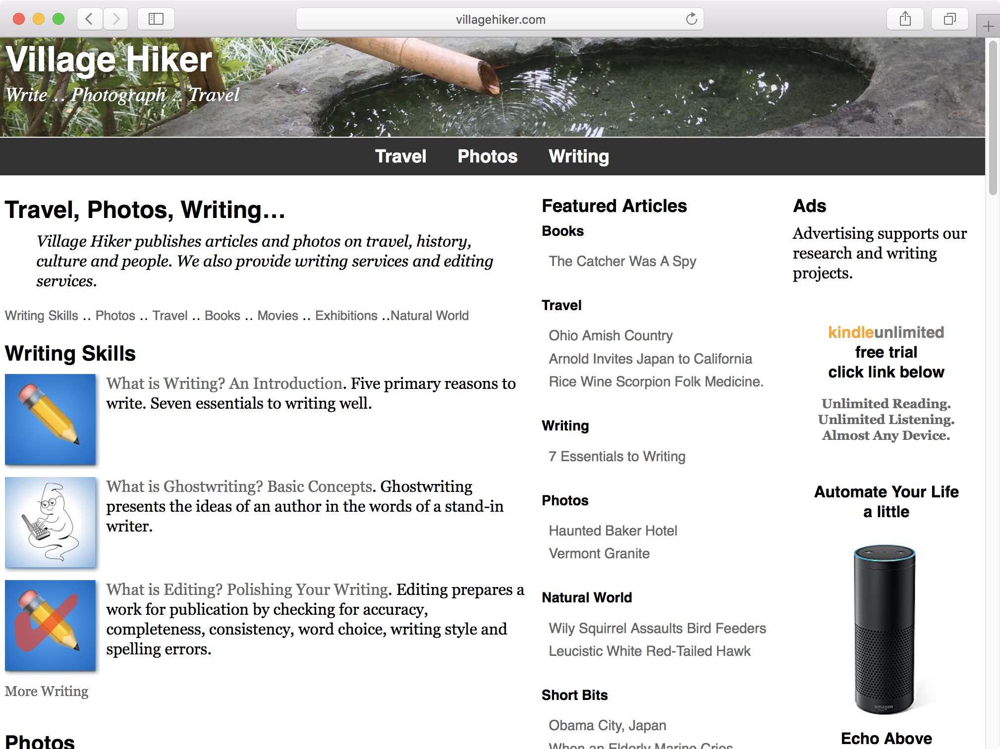

# Templer Case Study for Real-World Website

This case study describes the conversion of a 10-year-old hand-coded website to the Templer static-site generator. The site belongs to [Village Hiker Publishing Company](http://villagehiker.com).

The website uses a basic design employing only HTML and CSS. It contains no javascript.

The layout uses three columns:

* Left column for article links on index.html pages. It contains article text and images on content pages.
* Middle column for internal and external links to related content.
* Right column for affiliate advertising.

The site is responsive to desktop, tablet and smart phone browsers in a simple way. The middle and right columns move below the left column when the viewport is narrow. Images keep their percentage widths regardless of viewport width. Because the images are small in size even for desktop browsers, the site does not use responsive images. 

## Assumptions

This case study assumes familiarity with the Templer documentation. It assumes an understanding of the configuration file, the include files, the template files, the content files and concepts such as variables.

In summary:

* The Configuration file manages the overall settings for the website. The configuration file includes global variables, such as organization name and paths to folders.
* Template layout files use HTML to define the appearance of the website. A website design can use one or more template files. The Village Hiker site uses one.
* Include files contain information Templer can include on multiple pages. Changing information in an include file changes that information wherever Templer includes the file. Village Hiker uses these files for setting featured articles, external links and advertising content on individual pages.
* Content files contain articles to display as webpages. These can be written in HTML, Markdown or other formatting languages.  
* Variables define changeable content used in the template layout and the content pages. Village Hiker uses variables to build its index pages and to define include files to use for each content page. It also uses variables for page-specific information, such as the page title and page description, plus the meta data requested by social media sites.

## About the Case Study

The author of this case study is the owner and developer of the Village Hiker website. 

The original site contained 550-plus pages. The website consisted of text files, images and CSS. It used no javascript.

While most pages of the website looked similar to the user, the pages suffered from inconsistent HTML and CSS. Some pages used HTML 4, others used XHTML. More recent ones used HTML 5. Many of the pages used customized CSS to force the HTML into adaptive and responsive behaviors. The complexity of the site made it difficult to update.

## Case Study Elements

The case study describes:

* templer configuration file
* include files
* a single template layout
* page-specific content input files written in HTML and markdown formats
* images

It briefly highlights the conversion process.

## Software Versions

The Templer installation uses version 1.2 running on Perl version 5.16.0. Perl was installed on MacOS Sierra using PerlBrew, to avoid using the system Perl. The development environment is Coda 2 and the MacOS Terminal application.

## Website Status

The Templer-created site went online July 28, 2017. It receives updates multiple times each week. Such an updating schedule would very difficult without using a static-site generator.

## Website Design

The website uses a structured design. Following the design is important. The design provides consistency for users and supports the use of Templer.

### Website Purpose

The Village Hiker website serves as the business card and web presence of a writing and editing services company specializing in content development. The website provides originally-researched and developed content—including documentary-quality photos—on a variety of subjects to illustrate the capabilities of the company. The site contains a small amount of affiliate advertising, plus some Google ads, all separated from the articles.

### Website Sections

In addition to the root homepage level, the website contains five primary sections, each contained in a folder:

* About
* Photos
* Research-Writing
* Travel
* Store

The About, Research-Writing and Travel sections contain subfolders. Some of these folders contain their own subfolders. For example, the Research-Writing folder contains subfolders on topics such as books, nature and writing skills. And the Travel folder includes subfolders such as Japan, Taiwan and the USA. 

The root level contains an index.html file, as do most of the subfolders.

The top level folder and most subfolders also contain css and media subfolders.

### Text-File Naming 

File naming conventions provide for easily changing the featured articles presented on the index.html pages. The top-level homepage lists a subset of articles from each section and subsection. These subsets change weekly. The subsections also list article subsets on their index.html pages. Each index.html page at the lowest levels of a folder tree contain a list of all articles in its folder. 

Consider travel as an example. The homepage lists a few articles from each travel subsection—such as Japan, Taiwan, USA—plus a link to the travel section. The travel section index.html lists a few articles from each country, plus links to the country sections. The index.html pages for each country section—such as Vietnam and Travel Gear—list all articles in those sections. 

The naming pattern is `file-name-related-content-vh-tt-nn.wgn`, where:

* `file-name-related-content` describes the content.
* `-vh` identifies the file as belonging to the Village Hiker website.
* `-tt` identifies the type of content, such as as -ts for travel story or -jn for journal notes. This is optional.
* `-nn` provides a number used to glob files for general selection. Each contains contains a maximum of seven files with names ending in a specific number. 
* `wgn` is the file extension for input files.

An example is `chasing-the-vermilion-torii-wakayama-japan-vh-ts-00.wgn`, a travel story about Japan.

The website uses file globs to select the files to include in each index.html file. The naming convention supports file globing.

For example, the glob `taiwang: file_glob( travel-taiwan/*jn*.wgn)` includes all Taiwan journal (-jn) files in the index.

And the glob `vietnamg: file_glob( travel-vietnam/*01.wgn)` includes all Vietnam travel files with names ending in 01.

### Banner Images Via CSS

Each section uses it own page banner image. The banner is defined in a section-specific css file. The overall design includes a variable to define page-specific banner images, but this is not currently implemented. 

The current implementation uses fixed-named, section-specific css files. Every section of the folder includes a css folder containing the locally-customized css file. The template layout file pointes to a file name `custom.css` within a folder named css: `<link rel="stylesheet" href="css/customize.css">`

## Configuration File

The file `templer.cfg` contains website options. The Village Hiker website uses most of the defaults supplied with Templer. The most obvious exception includes setting many navigation path variables, each pointing pointing to a specific folder. The path variables accommodate the creation of menu links, plus internal links between content files. Examples of path variables include:

* `travelpath = path_to(travel)`
* `photospath = path_to(photos)`
* `writingpath = path_to(research-writing)`

The text to the left of the equal sign is a variable name. Using a path variable creates a correct href path from the source page to the destination page. For example, the variable `<a href="<!-- tmpl_var name='travelpath' -->/">Travel</a>` creates a correctly rendered link from:

* the root folder: `<a href="travel/">Travel</a>`
* a subfolder of the root folder: `<a href="../travel/">Travel</a>`
* a subfolder within a subfolder: : `<a href="../../travel/">Travel</a>`

This makes trivial the creation of menus within a template as the paths alway render correctly, regardless of the folder depth within the website. The same applies to links between internal content pages.

## Template Layout File

The Village Hiker site uses one page template. It works for both index.html pages and website content pages. The template uses both global and page-specific variables to make each page unique unique. blah blah blah.. 

## Include Files

## Page Files

### Index Pages

### Content Pages

